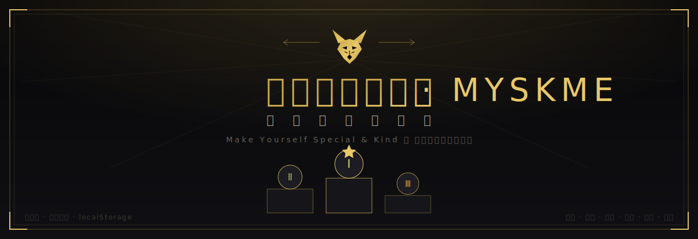

<p align="center">
  
</p>

<h1 align="center">王老师的英语课 · MYSKME 课堂记分编年史</h1>

<p align="center"><em>Make Yourself Special &amp; Kind ｜ 做独特而善良的自己</em></p>

<p align="center">
  <a href="https://myskme.github.io/myskme-scoreboard/"></a>
</p>

<p align="center">
  
  
  
  
  
</p>

一个**单文件**的课堂记分管理系统：记录、比较、排名、最佳小组、到课率/作业完成率，按赛季更新重置，可一键发布到网上，离线也能用。编年史视觉风格，**默认暖象牙浅色**，可一键切 **深色 / 跟随系统**，手机（横竖屏自适应）/平板/MacBook（投影）通吃。管理员误操作可 **撤销**（⌘/Ctrl+Z）。**可加到手机主屏**（PWA），点一下即开、断网也能记分。

> **▶ 立即试用：** <https://myskme.github.io/myskme-scoreboard/>

---

## ✨ 功能一览

| 模块 | 能做什么 |
|---|---|
| **记分台** | 两种录入：① *全景网格*（像 Excel 一样一眼看全班）② *单次课录入*（课堂上随手点名加分，数字会飞出）。点格子循环加分（课堂 0–3、作文 0–2 → **缺** → 空白），累计自动结算。**「缺」标识**把*缺席（课堂）/缺交（作文）*与*0 分（到了/交了但得 0）*、*未录（空白）*三者分开，到课率/作业完成率因此算得准。 |
| **团体战结算** | 选出本次课前 2 名小组，一键给胜组全员课堂补到 2、其余已出勤者补 1（不下调老师手填的更高分）。 |
| **排行榜** | SVG 金银铜领奖台 + 完整榜（标准竞赛排名，并列同名次）+ 三星徽章（课堂之星 / 作文之星 / 最佳进步）。 |
| **小组战** | 给学生分配小组，**最佳小组按「人均」评定**（各组人数不等时更公平），可切总分榜。 |
| **数据统计** | 班级均分趋势（折线，可切单个学生 vs 班级基准）、各次课均分（柱状）、累计分布、小组对比、**到课率 / 作业完成率**（班级 KPI + 每生小表，低于 70% 标红），以及**异常分值清单**（自动揪出像「课堂=8」这样的笔误）。 |
| **赛季管理** | 新建 / 切换 / 归档 / 复制开新季 / 重置（保留花名册或全清）/ 删除。跨赛季比较同一学生的成长。 |
| **数据·部署** | JSON 全量备份与还原（无损）、CSV 导出（给 Excel）、**MYSKME 画风荣誉卡 & 前三名海报**（狼先生纹徽 + 本相剪影 + 卡牌稀有度 UR/SSR/SR/R，可下载 PNG）、打印、GitHub 部署说明。 |

所有「累计 / 名次 / 最佳小组」都是**实时算出来的**，不存冗余，改任何分数立即正确。

---

## 🚀 怎么用

1. **直接用**：双击 `index.html` 用浏览器打开即可（推荐 Chrome / Edge / Safari）。已预置「6 月份」赛季的真实数据。
2. **录分**：进「记分台」，大屏复盘用*全景网格*，课堂实时点名用*单次课录入*。
3. **看结果**：「排行榜」看前三与之星，「小组战」看最佳小组，「数据统计」看趋势与异常。
4. **换月份**：到「赛季管理」点 **复制开新季**（保留这批学生和分组、清空分数），开始新一个月。

> 📌 预置数据里 **李昕诺 · 第3次课 · 课堂=8** 是原表格里的一处笔误，系统已在「数据统计 → 异常清单」里标红，点 **修正** 一下即可（之后「课堂之星」会自动重算）。

---

## 💾 数据存在哪里？（重要）

**代码在云端，数据在你这台浏览器。** 网页本身可以放到 GitHub / Netlify 让任何人打开，但你录入的分数存在**当前浏览器的本地存储 (localStorage)**，不会自动同步到别的设备。

所以养成两个习惯：
- 每节课后到「数据·部署」点一次 **导出 JSON 备份**，存进 iCloud / 网盘；
- 换电脑或清了缓存，用 **导入** 把那份 JSON 读回来即可完整还原。

（导入前系统会自动留一份「回滚备份」，导入出问题可在同一页点「恢复上次备份」。）

---

## 🔒 管理员编辑锁（谁能改、谁只能看）

- **所有人**打开网址都能**浏览**全部内容（榜单、统计、导出、打印）。
- 只有**输入管理员密码**才能**编辑**（录分、加减学生、改赛季、导入等）。
- 顶部右上角有一枚 **「🔒 浏览模式 · 解锁编辑」** 按钮：点它输入密码 → 解锁；解锁后变 **「✎ 管理员 · 点此锁定」**，再点即切回只读。解锁状态记在你这台浏览器里，下次打开免再输。

> **默认密码：`mrwolf`**（狼先生）。

**改密码**：在网页里按 F12 打开控制台，运行 `hashPass('你的新密码')` 拿到一串哈希，替换 `index.html` 顶部的 `ADMIN_HASH = "…"`，重新 `git push` 即可。

> ⚠️ **安全说明**：这是网页静态站，密码是「软锁」——能挡住普通学生/家长随手乱改，但**懂技术的人查看源码或控制台理论上能绕过**，不是强加密。对课堂记分足够；若要更强，需要后端，超出单文件范围。

---

## 🌐 发布到网上

### 方案 A · Netlify 拖拽（最快）
打开 <https://app.netlify.com/drop> → 把这个文件夹拖进去 → 立刻得到网址。改完再拖一次即更新，可设密码保护。

### 方案 B · GitHub Pages
```bash
cd myskme-scoreboard
git init
git add -A
git commit -m "MYSKME 课堂记分编年史"
git branch -M main
git remote add origin git@github.com:myskme/scoreboard.git   # 换成你的仓库
git push -u origin main
# 然后仓库 Settings → Pages → Source 选 main / root → 保存
# 访问 https://myskme.github.io/scoreboard/
```

> ⚠️ 仓库若**公开**，学生姓名会公开。介意请用 **private 仓库**（GitHub Pages 私有需 Pro，或改用 Netlify 私有部署）。

---

## 🎨 设计

- **黑金编年史**风格：深底 `#0a0a0c` + 金 `#c9a64a` + 衬线字，噪点底纹、四层人物徽章、统一发光、SVG 图表与领奖台（不用 emoji）。
- 移动端 760px 断点适配，离线零外部请求。

## 📁 文件

```
myskme-scoreboard/
├── index.html              ← 整个系统，单文件，直接打开/部署
├── manifest.webmanifest    ← PWA 清单（加到主屏的名称/图标/主题色）
├── sw.js                   ← Service Worker（离线缓存：外壳秒开、data.json 联网取最新）
├── icons/                  ← 主屏图标（192/512/maskable，黑金狼先生纹徽）
├── worker/publish-worker.js← 在线发布用的 Cloudflare Worker（藏 GitHub 令牌）
├── assets/cover.svg        ← README 封面图
├── data.json / seed-june.json ← 共享数据 / 6 月份原始数据
└── README.md
```

> **📲 加到手机主屏**：用 Safari/Chrome 打开 <https://myskme.github.io/myskme-scoreboard/> → 分享 → *添加到主屏幕*。之后像 App 一样点开，**断网也能记分**；联网时数据自动取最新。（需 https，本地双击 file:// 打开不启用离线缓存，但功能不受影响。）

---

*Mr. Wang · MYSKME 出品 · 不断完善中*
